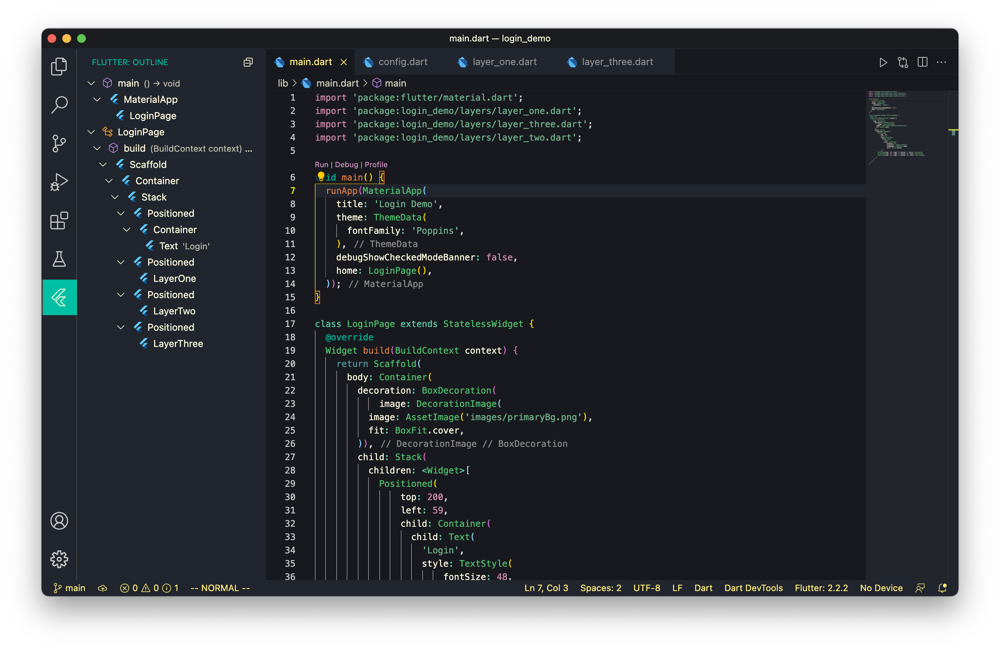
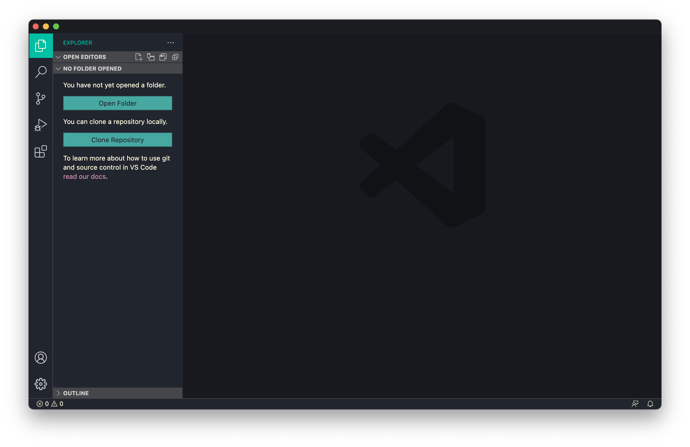
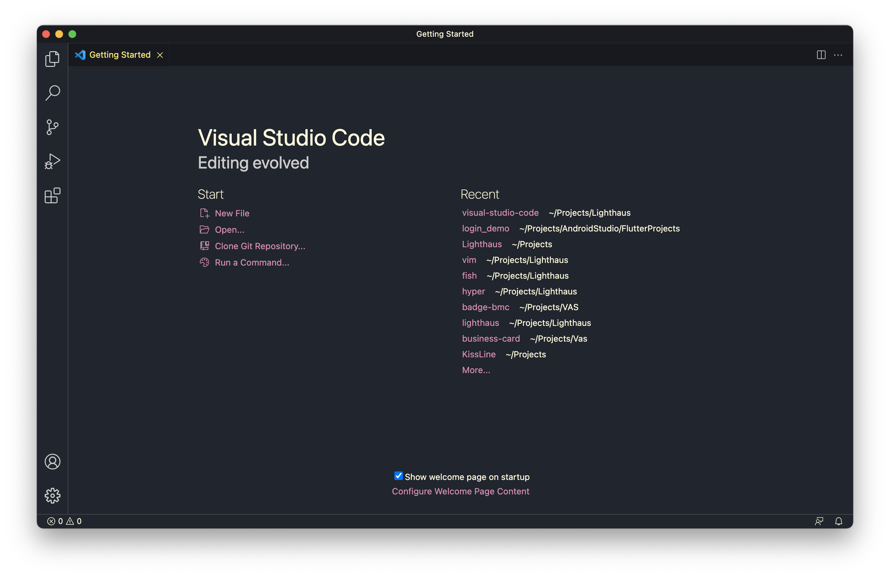
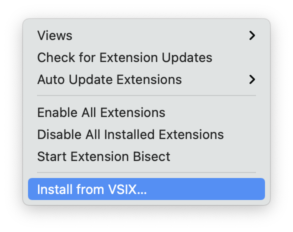

<p align="center"><p>

A [Lighthaus](https://github.com/lighthaus-theme/visual-studio-code) theme for [Visual Studio Code](https://code.visualstudio.com/).

### Table of Contents

- [Screenshots](#screenshots)
- [Installation](#installation)
- [Usage](#usage)
- [Contributing](#contributing)
- [Version](#version)
- [Bugs/Issues](#bugs/issues)
- [License](#license)

### Screenshots

<p align="center"><p>
<p align="center"><p>
<p align="center"><p>

**For more screenshots of UI components, please check [this]() out.**

### Installation

Lighthaus theme can be found on the official [VS Code Extensions Marketplace]().
To install it, simply: 
- Open the _Extensions Tab_ by clicking on it in the _Activity Bar_
- Search for `Lighthaus` and click `install`

If you would like to manually install it, download the latest release from [here]() and installing it using the  and going to:
- _Extensions Tab_
- _Three Dot Menu_
- Click on `Install from vsix`
<p align="center"><p>

- Select the `lighthaus-vscode-1.*.*.vsix` file.


### Usage

To activate the Lighthaus theme press:
- `Cmd+K Cmd+T` for Mac or `Ctrl+K Ctrl+T` for Windows
- Search for `Lighthaus` and select it
- Press `Enter` to confirm

### Contributing

Check out [CONTRIBUTING](https://github.com/lighthaus-theme/lighthaus/blob/master/CONTRIBUTING.md). 

Pull Request Template can be found [here](https://github.com/lighthaus-theme/lighthaus/blob/master/PULL_REQUEST_TEMPLATE.md) and Issues and Bugs Template [here](https://github.com/lighthaus-theme/lighthaus/blob/master/ISSUE_TEMPLATE.md).

### Version

``` vim
v 1.0.0
```

_Lighthaus and all it's projects use [Semantic Versioning](https://semver.org/)._ <br/>
_All changes are recorded in [CHANGELOG](https://github.com/lighthaus-theme/zathura/blob/master/CHANGELOG.md)_

### Bugs/Issues

Please report any bugs or issues [here](https://github.com/lighthaus-theme/visual-studio-code/issues). Issues and Bugs Template can be found [here](https://github.com/lighthaus-theme/lighthaus/blob/master/ISSUE_TEMPLATE.md).

### License 

_Copyright © 2021-Present Lighthaus Theme_  
_Copyright © 2021-Present Adhiraj Sirohi_  
_Copyright © 2021-Present Vasundhara Sharma_

<p align="left"><a href="https://github.com/lighthaus-theme/visual-studio-code/blob/main/LICENSE"></a></p>

<p align="center"><p>
