

<h2 align="center">Screenshots</h2>

Notifications blend well with the rest of the UI while the buttons add a pop of brightness. 

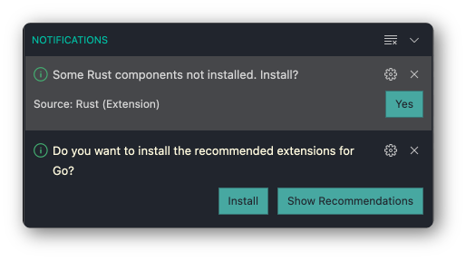

Git colors in the `Explorer` help with keeping track of file changes, deletions, renaming etc. at a glance.

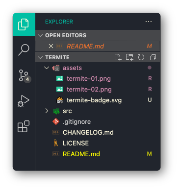

Differences are very clear and easy to distinguish. Lightly highlighted borders help in noticing single line differences particularly in larger files while also not distracting from the actual content of the file.

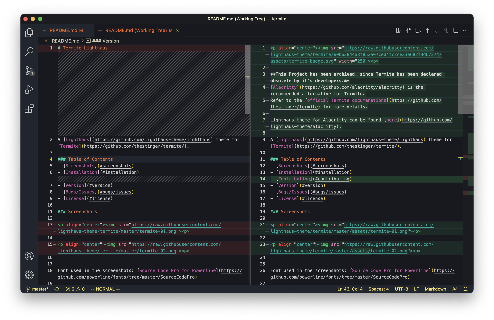

Searches get brightly highlighted in the `minimap`. Background highlight of the searched term makes it easy to spot on the screen.

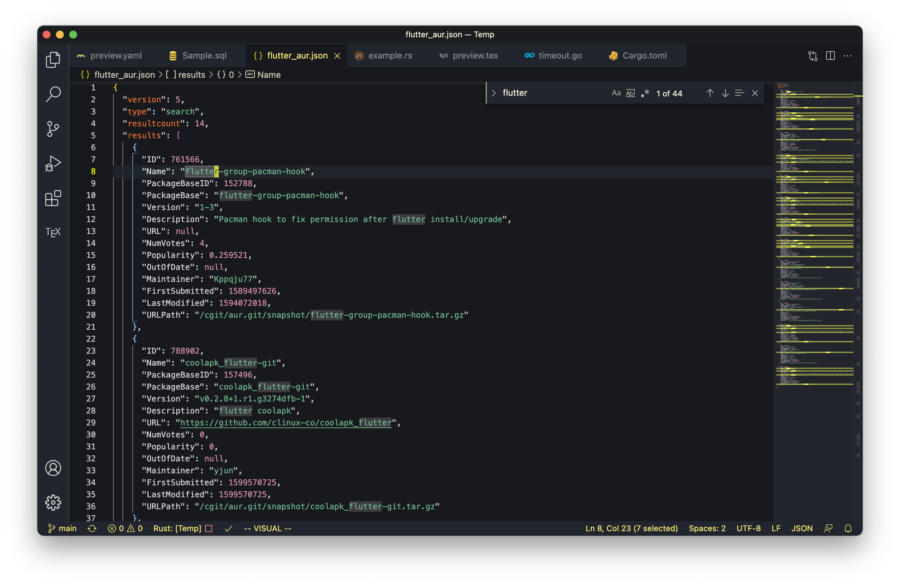

Suggestions popup blend very well in the UI. Colored in a way that makes them very easy to differentiate according to relevance.

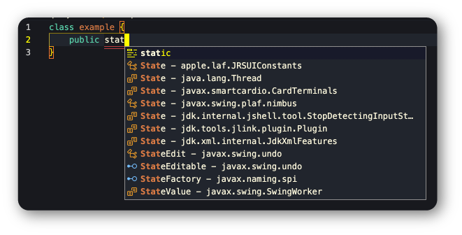

### Examples for some File Types

##### Dart Example

##### Go Lang Example

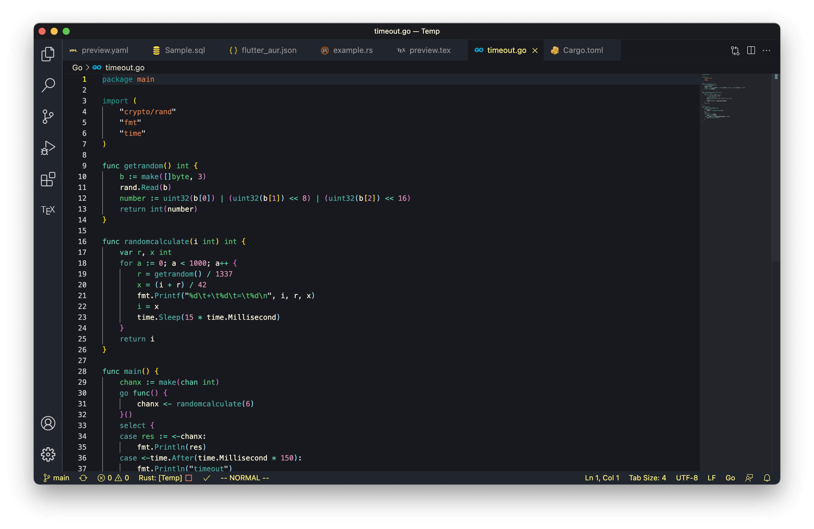

##### JSON Example

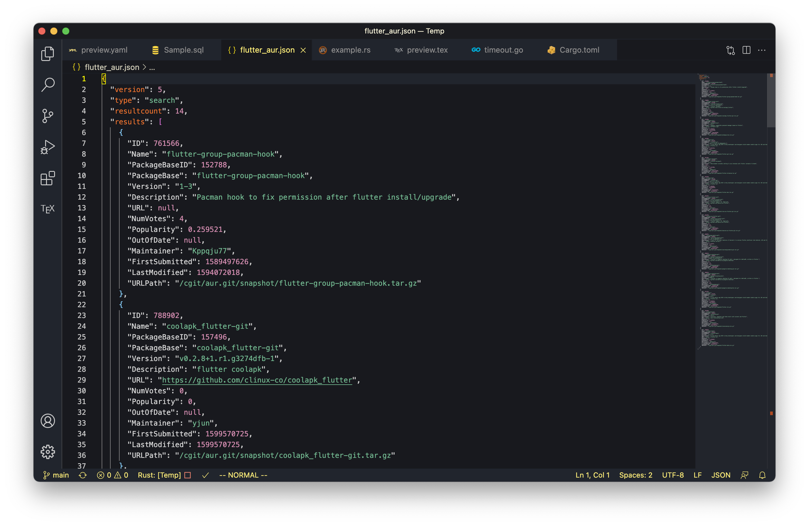

##### LaTex Example

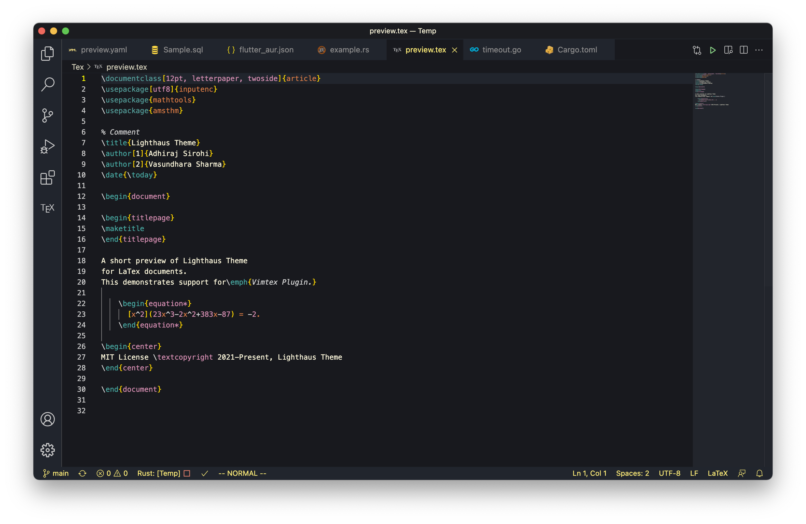

##### Rust Example

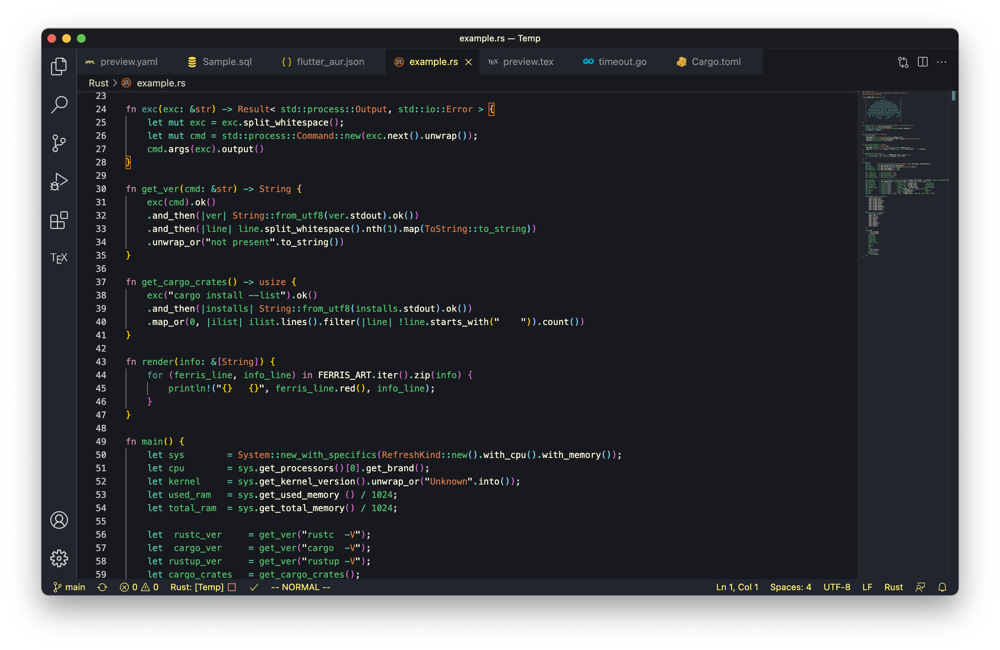

##### SQL Example

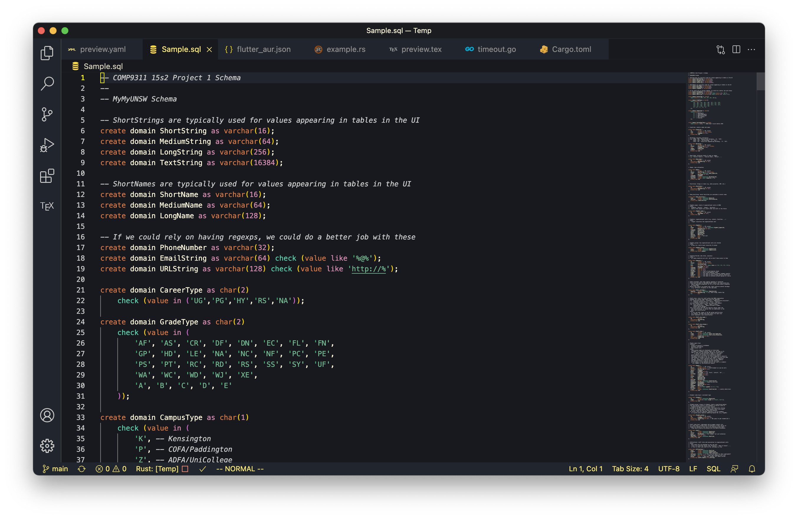

##### TOML Example

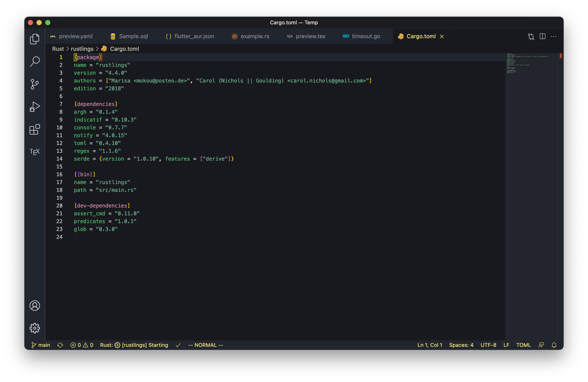

##### YAML Example

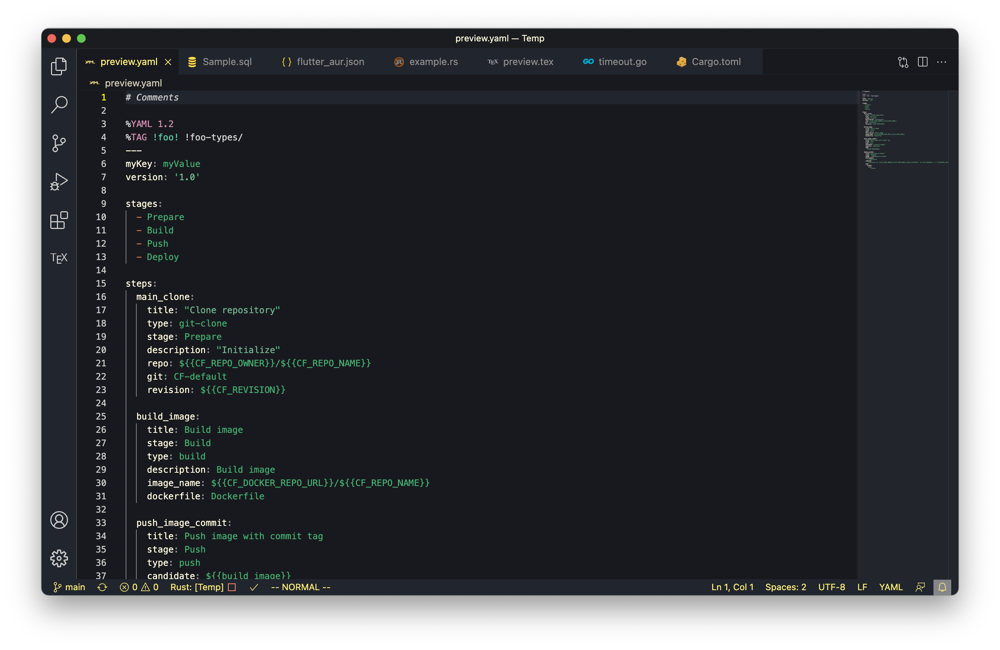

